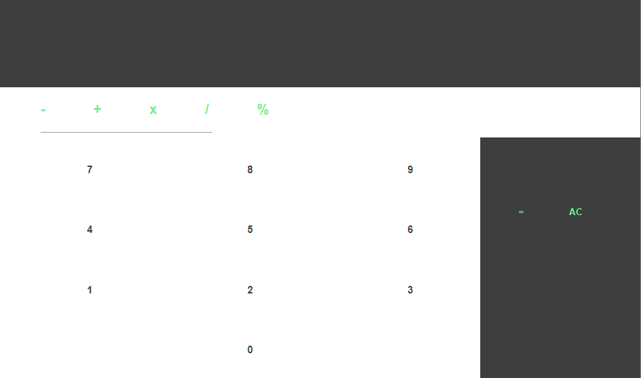

<h1>SIMPLE CALCULATOR </h1>

 <h2>Description</h2>
 
This is a simples calculator that a desenvolved to traing my skills in javascript and also do some UI Design. The calculator itself it's a difficult, but got me trough concepets that i need to learn.

 <h2>Functionality</h2>
 
About the funcionality, there's nothing much to say, it's a really a simple calculator.
 <h2>Tools</h2>
 
The lenguage used is Javascript, the main reason of the choice of this lenguage is to improve my skills in it, and also to improve my code thinking.

 
For the layout i used Grid Layout to get better perfomance.
 <h2>Challenges and Improval</h2>
 
Now, i'll put some points that for me where important and difficult.

 <ul>
  <li>The understand of absctraction from your code, in this code is lower level of abstraction, make understand better how to make cleaner code</li>
  <li>The rendering elements on screen after a function call</li>
  <li>One top the was one of most difficult was using CSS to layout the calculator, it makes understand better how Grid Layout works.
 </ul> 
 <h2>Overview</h2>
 
